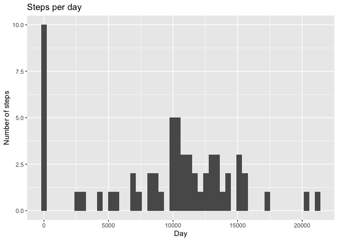
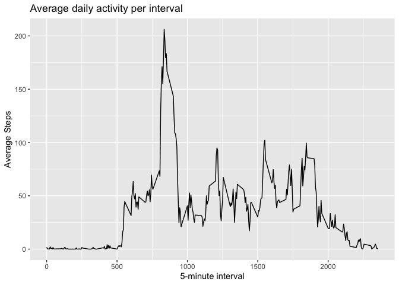
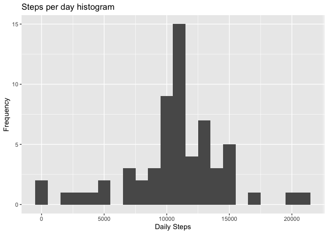
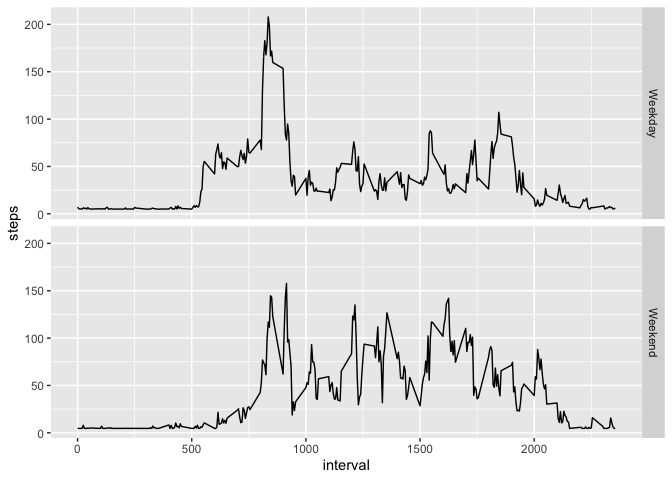

## Defining global options
Let's define echo=TRUE from now on and load required libraries

```r
library(knitr)
opts_chunk$set(echo=TRUE)
library(ggplot2)
library(dplyr)
```

```
## 
## Attaching package: 'dplyr'
```

```
## The following objects are masked from 'package:stats':
## 
##     filter, lag
```

```
## The following objects are masked from 'package:base':
## 
##     intersect, setdiff, setequal, union
```

## Loading and preprocessing the data
Unzip the data and store on act_data dataset variable. Let's check how it looks like.

```r
unzip("activity.zip")
act_data <- read.csv("activity.csv", header = TRUE)
str(act_data)
```

```
## 'data.frame':	17568 obs. of  3 variables:
##  $ steps   : int  NA NA NA NA NA NA NA NA NA NA ...
##  $ date    : chr  "2012-10-01" "2012-10-01" "2012-10-01" "2012-10-01" ...
##  $ interval: int  0 5 10 15 20 25 30 35 40 45 ...
```

```r
head(act_data)
```

```
##   steps       date interval
## 1    NA 2012-10-01        0
## 2    NA 2012-10-01        5
## 3    NA 2012-10-01       10
## 4    NA 2012-10-01       15
## 5    NA 2012-10-01       20
## 6    NA 2012-10-01       25
```

```r
summary(act_data)
```

```
##      steps            date              interval     
##  Min.   :  0.00   Length:17568       Min.   :   0.0  
##  1st Qu.:  0.00   Class :character   1st Qu.: 588.8  
##  Median :  0.00   Mode  :character   Median :1177.5  
##  Mean   : 37.38                      Mean   :1177.5  
##  3rd Qu.: 12.00                      3rd Qu.:1766.2  
##  Max.   :806.00                      Max.   :2355.0  
##  NA's   :2304
```


## What is mean total number of steps taken per day?

```r
stepsbyday <- tapply(act_data$steps, act_data$date, FUN=sum, na.rm=TRUE)
qplot(stepsbyday,  xlab="Day", ylab="Number of steps",main="Steps per day",bins=50)
```

<!-- -->

Let's calculate the mean value

```r
mean1 <- mean(stepsbyday, na.rm=TRUE)
mean1
```

```
## [1] 9354.23
```

Now the median

```r
median1 <- median(stepsbyday, na.rm=TRUE)
median1
```

```
## [1] 10395
```


## What is the average daily activity pattern?

```r
meanbyinterval <- aggregate(x=list(steps=act_data$steps), by=list(interval=act_data$interval),
                      FUN=mean, na.rm=TRUE)
ggplot(data=meanbyinterval, aes(x=interval, y=steps)) +
  geom_line() +
  ggtitle ("Average daily activity per interval")+
  xlab("5-minute interval") +
  ylab("Average Steps")
```

<!-- -->

Which 5-minute interval, on average across all the days in the dataset, contains the maximum number of steps?

```r
meanbyinterval[which.max(meanbyinterval$steps),]
```

```
##     interval    steps
## 104      835 206.1698
```


## Imputing missing values
Let's check the number of NAs.

```r
missing <- is.na(act_data$steps)
sum(missing)
```

```
## [1] 2304
```

To reduce the bias due to the missing, we will assign the mean value per interval


```r
# Replace each missing value with the mean value of its 5-minute interval
actdata_nona <- act_data
actdata_nona$steps[is.na(actdata_nona$steps)] <- mean(actdata_nona$steps,na.rm=TRUE)
actdata_nona$steps <- as.numeric(actdata_nona$steps)
actdata_nona$interval <- as.numeric(actdata_nona$interval)

summary(actdata_nona)
```

```
##      steps            date              interval     
##  Min.   :  0.00   Length:17568       Min.   :   0.0  
##  1st Qu.:  0.00   Class :character   1st Qu.: 588.8  
##  Median :  0.00   Mode  :character   Median :1177.5  
##  Mean   : 37.38                      Mean   :1177.5  
##  3rd Qu.: 37.38                      3rd Qu.:1766.2  
##  Max.   :806.00                      Max.   :2355.0
```

Make a histogram of the total number of steps taken each day and Calculate and report the mean and median total number of steps taken per day. Do these values differ from the estimates from the first part of the assignment? 

```r
# Summarize data by date
stepsbydate <- summarize(group_by(actdata_nona,date),daily.step=sum(steps))
```

The new values are different from the ones obtained without removing the NA

```r
mean2   <- mean(stepsbydate$daily.step)
mean2
```

```
## [1] 10766.19
```

```r
median2 <- as.integer(median(stepsbydate$daily.step))
median2
```

```
## [1] 10766
```


```r
ggplot(stepsbydate, aes(x=daily.step)) + 
  labs(title="Steps per day histogram", y="Frequency", x="Daily Steps") +
  geom_histogram(binwidth = 1000) 
```

<!-- -->

```r
mean2   <- mean(stepsbydate$daily.step)
mean2
```

```
## [1] 10766.19
```

```r
median2 <- as.integer(median(stepsbydate$daily.step))
median2
```

```
## [1] 10766
```


## Are there differences in activity patterns between weekdays and weekends?
First we will add a factor with the type of day (Weekday or Weekend)

```r
actdata_nona$dayofweek <- weekdays(as.Date(actdata_nona$date))
actdata_nona$typeofday <-as.factor(actdata_nona$dayofweek=="Saturday"|actdata_nona$dayofweek=="Sunday")
levels(actdata_nona$typeofday) <- c("Weekday", "Weekend")
```

We will summarize the mean by "step" for every type of day

```r
actdata_wd <- actdata_nona[actdata_nona$typeofday=="Weekday",]
actdata_we <- actdata_nona[actdata_nona$typeofday=="Weekend",]

#Then for each one, I find the mean number of steps across days for each 5 minute interval:
actdata_wd_int <- group_by(actdata_wd, interval)
actdata_wd_int <- summarize(actdata_wd_int, steps=mean(steps))
actdata_wd_int$typeofday <- "Weekday"
actdata_we_int <- group_by(actdata_we, interval)
actdata_we_int <- summarize(actdata_we_int, steps=mean(steps))
actdata_we_int$typeofday <- "Weekend"
```

Let's bind both datasets to plot it

```r
actdata_int <- rbind(actdata_wd_int, actdata_we_int)
actdata_int$typeofday <- as.factor(actdata_int$typeofday)
ggplot(actdata_int, aes(interval, steps)) + geom_line() + facet_grid(typeofday ~ .)
```

<!-- -->
